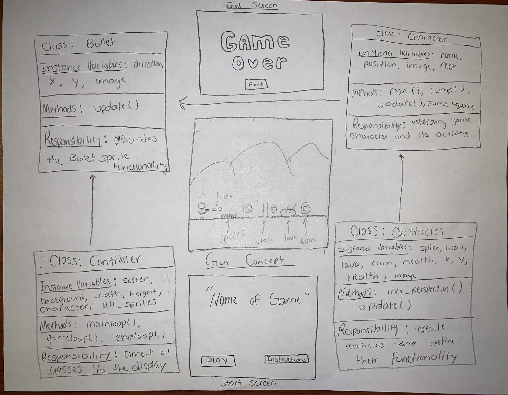

:warning: Everything between << >> needs to be replaced (remove << >> after replacing)

# << Project Title >>
## CS 110 Final Project
###    Fall, 2019
### [Assignment Description](https://drive.google.com/open?id=1HLIk-539N9KiAAG1224NWpFyEl4RsPVBwtBZ9KbjicE)

 (https://github.com/bucs110/final-project-fall19-ferg-the-turtle)(#)

(https://docs.google.com/presentation/d/1YZ-FDzJOmY7Qsc7-lrNABPbtwpS0riJZNaZ1BiUilF4/edit#slide=id.p)(#)

### Team: Ferg the Turtle
#### Christopher Simak, Aidan Ferguson, Joe Lieberman

***

## Project Description
 This game is a 2-D sidescroller. The player spawns in as a character that runs sideways. In the way of the character are obstacles (spikes and wall). The player can fire a bullet to destroy these obstacles. If the player comes into contact with any of these obstacles, the game will end. As the game goes on, the player collects coins to increase his score.

***    

## User Interface Design
* << The Main Menu/Start Screen >>
    This screen is the first screen the user sees when main.py is ran. It contains the name of the game (Space Run),
    and the instructions. If the user hits the 'space' key, the game will run. If the user clicks the red x in the top
    right, they will exit out of the screen.
    
* << The Game Screen >>
    This screen is accessed by the user hitting space bar when on the start screen. On this screen, the character and
    screen will be moving. There also will be obstacles on the screen. Pressing the space bar or the up arrow will cause
    the character to jump up. Clicking the 'z' key will allow the character to shoot a bullet across the screen.
    Picture is not available, this is what it would/should look like (the middle picture):
    

* << The End Screen/Game Over Screen >>
    This screen is accessed when the character dies. It will say "Game Over. Press Space to play again". Pressing space
    will cause the game screen to pop up and the game will run again. To exit the game, the user should press the
    'red X' in the top left corner.space
    

***        

## Program Design
* Non-Standard libraries
    * Pygame (https://www.pygame.org/) - cross-platform set of Python modules designed for writing video games. It includes computer graphics and sound libraries designed to be used with the Python programming language.

    * << This picture represents the relationships between the different classes >>
        * 
    * This does not need to be overly detailed, but should show how your code fits into the Model/View/Controller paradigm.
* Classes
    * Hero - the hero class  >>

***

## Tasks and Responsibilities
* You must outline the team member roles and who was responsible for each class/method, both individual and collaborative.

### Software Lead - << Aidan Ferguson  >>

<< Worked as integration specialist by... >>

### Front End Specialist - << Joe Lieberman >>

Front-end lead conducted significant research on the controller and GUI of the program. The GUI (Graphical User
Interface) is the screen the user sees when they run the game. The GUI, in this case, consists of the gameIntroScreen,
game-screen, and gameOverScreen. I also worked with the Back End Specialist on incorporating the models into the
controller. The controller is where the GUI is created. The controller also contains most of the code for the game.

### Back End Specialist - << Chris Simak >>

 I helped with the “Model” portion of Space run by writing the major classes that would be used in the main game. I also created methods for the game mechanics of the hero such as run, jump, and run and shoot. I maintained persistent data by sending the position of the sprites to a json file. I worked with the Front End Specialist in the implementation of the classes into our Controller file which uses all of the sprites from the classes to create the game.

## Testing
* << Describe your testing strategy for your project. >>
    * << Example >>

* Your ATP

| Step                  | Procedure     | Expected Results  | Actual Results |
| ----------------------|:-------------:| -----------------:| -------------- |
|  1  | Run game program   | self.gameIntroScreen() displays controls: "Hit space to jump, Hit "z" to shoot. Press space to play." over (backgrounbndimg.jpg) |          |
|  2  | Press <spacebar> to exit menu and begin game  | self.state now == GAME, hero appears and starts self.running in sidescroller over game background   |               |
|  3  | Within game, press <space> when hero encounters obstacle  | timed right, hero will run jump over the spikes/lava and resume self.running |          |
|  4  | Allow hero to run into coin  | Hero will collect coin, causing self.bullets.add thus self.bullets != 0  |     |
|  5  | Press <z> when hero encounters wall  | With self.bullets != 0, hero shoots bullet at wall, causing self.wall.kill, wall breaks and hero continues running  |           |
|  6  | Allow hero to run into spikes/lava/wall, losing game  |  gameOverScreen() will run, causing self.hero.kill which will "kill" self.running and end the game  |         |    
